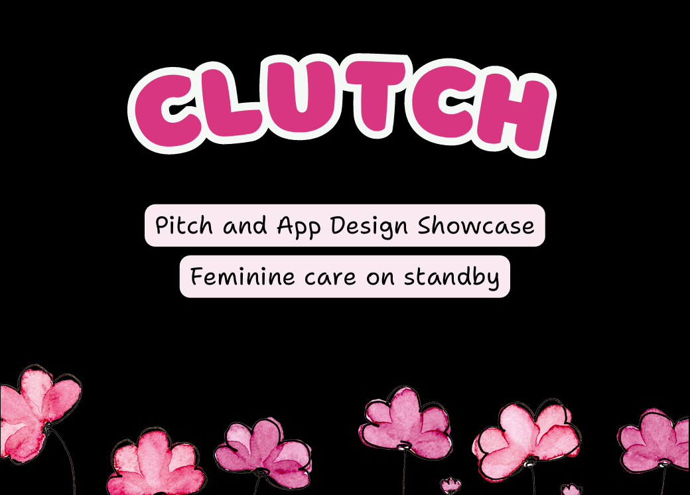

# Clutch - 1st Place Win HackHers 2025

> ## Feminine help on standby!

Clutch was born from a familiar moment of panic on campus like needing an essential item, such as a tampon, painkiller, or heating pad, but having no way to get it quickly and conveniently.

We saw a clear gap in student support where these crucial wellness and hygiene items were inaccessible. We built Clutch to be a community-powered safety net, ensuring no student's success is compromised by a simple lack of access to personal care.

## Watch Demo by clicking on image below:

## View our UI/UX Design:
[Click here to view UI/UX Design](https://www.canva.com/design/DAG2JrF2TTY/3F1hJUEBA9j9Y7B5FR8TuA/view?utm_content=DAG2JrF2TTY&utm_campaign=designshare&utm_medium=link2&utm_source=uniquelinks&utlId=hc62c75ffbe)

## ✨ What it Does

Clutch is your one-tap safety net for campus essentials.

### Features:

-   **INSTANT ACCESS**: Tap "Request" to instantly find essentials from trusted campus spots and verified peers.
-   **SMART SAFETY**: Connect confidently with built-in safety warnings and explicit consent checks.
-   **PAY IT FORWARD**: Easily donate items to verified users and organizations to build the community.

## 🚀 Built With

-   **Frontend/Backend:** Next.js, Tailwind, CSS, React
-   **Database:** Firebase
-   **APIs:** OpenAI 
-   **Deployment:** Vercel

## ⚙️ How to Run It Locally

To get the project running on your computer, follow these steps:

**Installation & Startup:**
1. Clone the repository: git clone <your-github-repository-url>
2. cd hack-hers-2025
3. npm install
4. npm run dev
